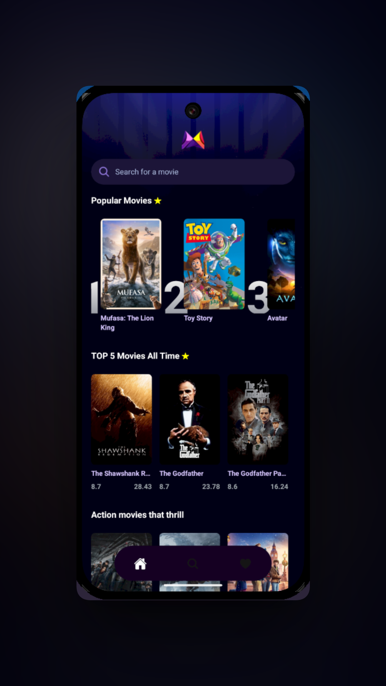
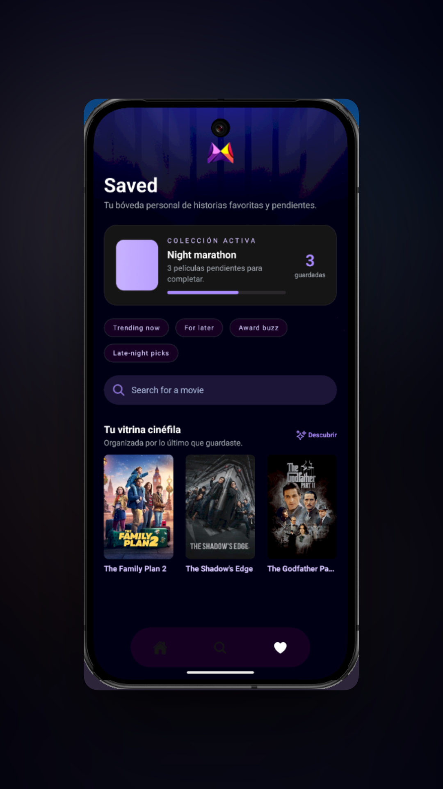
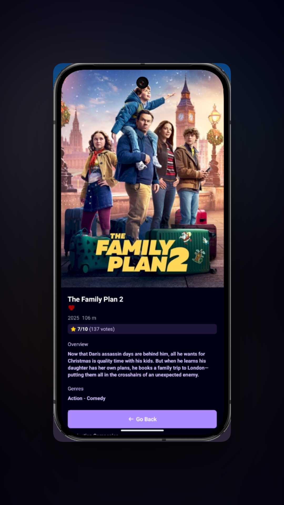

# 🎬 MovieApp

Una aplicación móvil moderna y elegante para descubrir, explorar y gestionar tus películas favoritas. Diseñada con una interfaz minimalista y funcional que ofrece una experiencia cinematográfica premium.

## ✨ Características

- **Descubrimiento de películas**: Explora películas populares, trending y las mejores calificadas de todos los tiempos
- **Búsqueda avanzada**: Encuentra cualquier película rápidamente con búsqueda en tiempo real
- **Organización por géneros**: Navega por categorías como Acción, Aventura, Thriller, Comedia y Horror
- **Lista de favoritos**: Guarda y organiza tus películas favoritas en una colección personal
- **Perfil de usuario**: Gestiona tu perfil, preferencias y estadísticas de visualización
- **Detalles completos**: Accede a información detallada de cada película, incluyendo sinopsis, reparto y calificaciones

## 🎨 Diseño

La aplicación cuenta con un diseño moderno y minimalista con:
- Tema oscuro elegante con acentos morados y teal
- Interfaz intuitiva y fácil de navegar
- Animaciones fluidas y transiciones suaves
- Experiencia visual cinematográfica

## 🛠️ Tecnologías

- **React Native** con **Expo**
- **TypeScript** para type safety
- **NativeWind** (Tailwind CSS para React Native)
- **Expo Router** para navegación
- **Appwrite** para backend y almacenamiento
- **TMDB API** para datos de películas
---

*Disfruta explorando el mundo del cine con MovieApp* 🍿 

  
  
  

